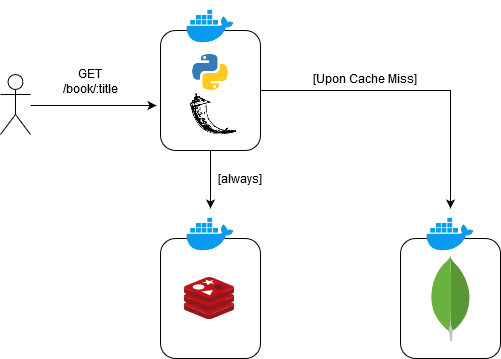

# mongoredis
This a trivial web service that demonstrates the usage of Redis as a cache layer inside a web application.

This work resembles the one described in [this blog article](https://www.sitepoint.com/caching-a-mongodb-database-with-redis/).
Basically I used Python instead of Node.js. Furthermore I provided an isolated execution environment for the application by depoloying it inside a Docker network.

The web service exposes two entry point:
- `POST /book` stores a book with the information encapsulated in the HTTP request body
- `GET /book/:title` returns the book with the given title

The title is assumed to identify uniquely the book.

The books are stored in a Mongo database.
When a `GET` request is received, the web services first searches for the book inside Redis, that here acts as a cache. Upon cache miss, the service stores the book in Redis before returning it to the client. 

To avoid memory overloading, Redis was configured with a LRU caching policy. See [redis.conf](https://github.com/redefik/mongoredis/blob/master/redis/redis.conf)

Disclaimer: No particular attention was paid to error handling and other cross-cutting concerns, since the main purpose was to demonstrate the usage of Redis as a cache.

